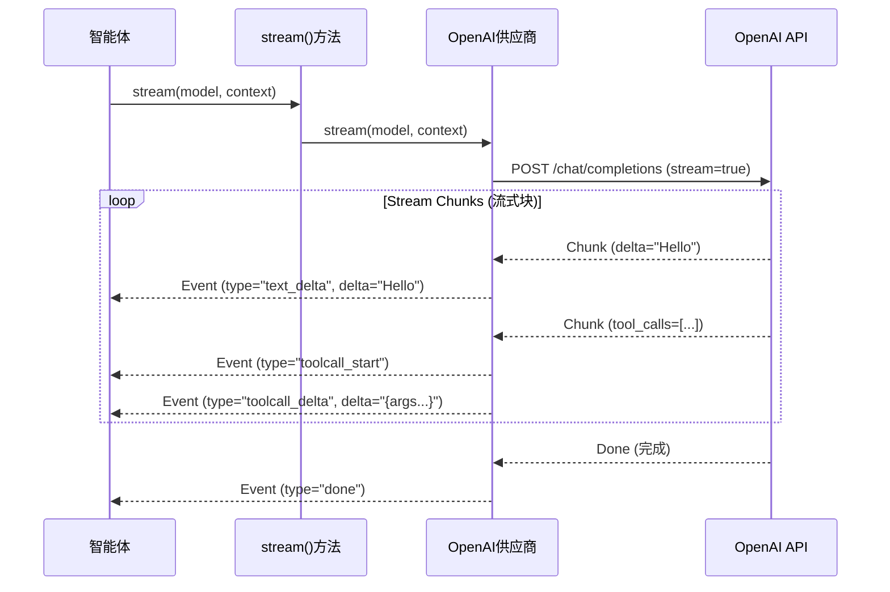

# 全局架构与 `ai` 包分析

## 1. 项目概览
该项目是一个基于 TypeScript 的 Monorepo，旨在构建 AI 智能体（Agent）并管理 LLM 部署。它采用分层架构，将核心 AI 能力抽象为一个独立的包 (`@mariozechner/pi-ai`)，供智能体运行时 (`@mariozechner/pi-agent-core`) 和具体应用（如编码助手 `@mariozechner/pi-coding-agent`）调用。

### 高层架构分层
1.  **基础层 (`packages/ai`)**: 统一的多供应商 LLM 接口。它规范了输入（消息、工具）和输出（流、工具调用），屏蔽了 OpenAI、Anthropic、Google 等 API 的差异。
2.  **运行时层 (`packages/agent`)**: 定义了“智能体循环 (Agent Loop)”、状态管理、工具接口和执行逻辑。它调用基础层与 LLM 进行交互。
3.  **应用层**:
    *   `packages/coding-agent`: 专为软件开发设计的智能体，包含 CLI 和特定模式。
    *   `packages/mom`: Slack 机器人集成。
    *   `packages/pods`: vLLM 部署管理工具。
4.  **接口层**:
    *   `packages/tui`: 终端用户界面 (Terminal User Interface)。
    *   `packages/web-ui`: Web 组件库。

---

## 2. `ai` 包分析
`ai` 包是系统与 LLM 交互的核心。它通过提供单一的标准化接口，解决了 LLM API 碎片化的问题。

### 核心组件

#### 2.1 统一类型定义 (`src/types.ts`)
该包定义了一套所有供应商必须遵循的标准类型：
*   **`Model<TApi>`**: 描述模型的能力（上下文窗口、成本、推理支持）。
*   **`Message`**: `UserMessage`、`AssistantMessage` 和 `ToolResultMessage` 的联合类型。这规范了聊天记录的格式。
*   **`Context`**: 封装发送给 LLM 的状态（系统提示词、历史记录、工具）。
*   **`AssistantMessageEventStream`**: 核心返回类型。它不返回简单的 Promise 或原始流，而是返回一个结构化的事件流，发出类型化的事件（如 `text_delta`、`toolcall_start`、`thinking_delta` 等）。

#### 2.2 供应商策略模式 (`src/api-registry.ts` & `src/stream.ts`)
系统使用注册表/策略模式。
*   **注册**: 供应商通过 `registerApiProvider` 注册自己。
*   **解析**: 当调用 `stream()` 时，系统根据 `model.api` 查找正确的供应商实现。
*   **抽象**: 消费者（如 Agent）只需调用 `stream(model, context)`，无需关心底层是调用 GPT-4 还是 Claude 3.5。

#### 2.3 流式实现 (Streaming)
流式处理是一等公民。`AssistantMessageEventStream` 规范了不同供应商之间的混乱差异：
*   **OpenAI**: 数据块在 `choices[0].delta.content`。
*   **Anthropic**: 事件是 `content_block_delta`。
*   `ai` 包将这些统一为：
    ```typescript
    | { type: "text_delta"; delta: string; ... }
    | { type: "toolcall_delta"; delta: string; ... }
    | { type: "thinking_delta"; delta: string; ... }
    ```
这是一个显著的设计优势，使得 UI 可以统一渲染“思考过程”或“工具使用”，而无需关心后端是谁。

### 代码级亮点

#### OpenAI 兼容性处理 (`providers/openai-completions.ts`)
实现远不止简单的封装。它处理了“OpenAI 兼容”生态系统（Groq, Mistral, OpenRouter）的细微差别：
*   **兼容性标志 (Compat Flags)**: `OpenAICompletionsCompat` 接口允许切换特定怪癖（例如 `requiresToolResultName`，`supportsReasoningEffort`）。
*   **推理/思考 (Reasoning/Thinking)**: 它将“推理 Token”（OpenAI 放在 `usage` 中，其他厂商放在 `delta.reasoning_content` 中）标准化为统一的 `thinking_delta` 事件。
*   **工具调用标准化**: 处理 ID 标准化（例如 Mistral 要求 9 字符 ID）。

#### Anthropic 特性支持 (`providers/anthropic.ts`)
*   **Prompt 缓存**: 显式处理 Anthropic 的 `cache_control` 头，这是降低长对话成本和延迟的强大功能。
*   **自适应思考**: 支持 Claude 3.7 的“自适应 (adaptive)”思考模式，区别于旧版的“预算 (budget)”思考模式。

---

## 3. 图表

### 类图：供应商抽象
```mermaid
classDiagram
    class StreamFunction {
        <<interface>>
        (model, context) => AssistantMessageEventStream
    }

    class ApiProvider {
        +Api api
        +StreamFunction stream
        +StreamFunction streamSimple
    }

    class OpenAIProvider {
        +stream()
        -createClient()
        -convertMessages()
    }

    class AnthropicProvider {
        +stream()
        -createClient()
        -convertMessages()
    }

    class Registry {
        -Map providers
        +register()
        +get()
    }

    ApiProvider <|-- OpenAIProvider
    ApiProvider <|-- AnthropicProvider
    Registry --> ApiProvider : manages
```

### 时序图：流式处理流程


## 4. 评估与设计价值

### 优点
1.  **强大的标准化**: 最具价值的地方在于它彻底地规范了边缘情况（如 Mistral 的工具 ID 要求，不同的“思考”格式）。
2.  **面向未来**: `OpenAICompletionsCompat` 标志允许在不更改核心逻辑的情况下添加新的“OpenAI 类”供应商。
3.  **丰富的事件流**: 事件流包含 `partial`（部分）消息状态，使得 UI 可以在任何帧重新渲染完整状态，而无需自己维护缓冲区。

### 缺点 / 改进空间
1.  **复杂性**: `openai-completions.ts` 文件正变成一个处理所有 OpenAI 兼容逻辑的“上帝对象”。它通过大量的 `if/else` 检查兼容性标志来处理 Groq, Mistral, xAI 等。这可能导致维护困难。
2.  **硬编码逻辑**: 一些供应商的怪癖（如在 `detectCompat` 中的特定 URL 检查）是硬编码的，而非配置驱动的。

## 5. 总结
`packages/ai` 模块是一个成熟的、生产级的抽象层。它不仅媲美 Vercel AI SDK Core 等库，而且提供了对“思考”模型和利基供应商怪癖的更细粒度控制，这对于依赖精确工具执行的健壮 Agent 至关重要。
