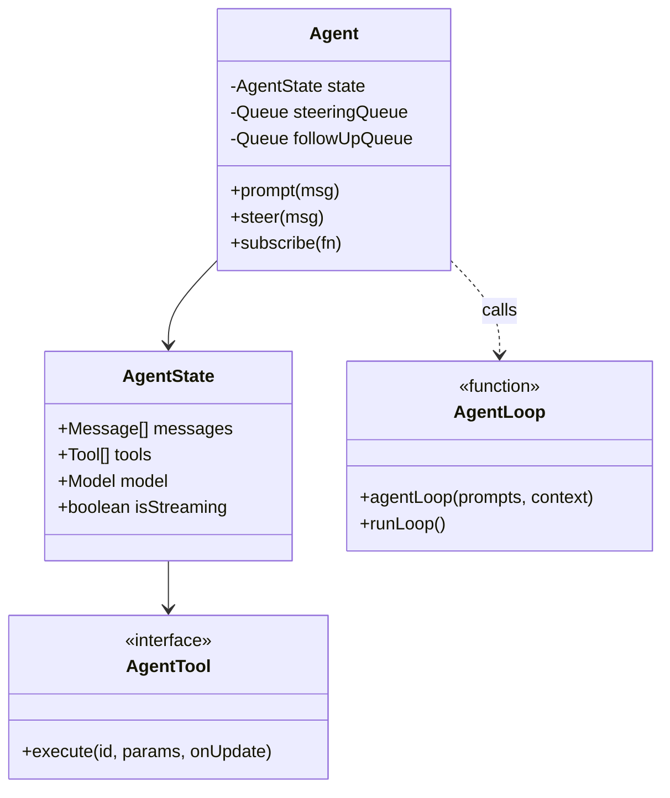

# 核心智能体运行时分析 (`packages/agent`)

## 1. 概述
`packages/agent` 模块实现了 AI 智能体的运行时逻辑。如果说 `packages/ai` 负责与 LLM **对话**，那么 `packages/agent` 则负责 **思考、记忆和行动**。

它实现了一个 "ReAct" (Reasoning + Acting, 推理+行动) 循环，并具备 **Steering (引导/干预)**、**流式工具结果** 和 **状态管理** 等高级特性。

## 2. 核心组件

### 2.1 `Agent` 类 (`agent.ts`)
`Agent` 类是主要入口点。它是一个有状态的对象，维护着：
*   **状态 (State)**: 对话历史 (`messages`)、当前模型、工具和系统提示词。
*   **队列 (Queues)**:
    *   `steeringQueue`: 在当前工具执行完毕后，**立即**中断智能体的消息。
    *   `followUpQueue`: 等待智能体完成当前任务后再处理的消息。
*   **生命周期 (Lifecycle)**: 它发出 UI 订阅的事件（`message_start`, `tool_execution_start`, `turn_end`）。

### 2.2 智能体循环 (`agent-loop.ts`)
这是智能体的“引擎”。它被设计为一个生成器/流，不断产生事件。

**循环逻辑:**
1.  **开始回合 (Start Turn)**: 发送历史记录给 LLM。
2.  **流式响应 (Stream Response)**: 接收来自 LLM 的文本/思考/工具调用。
3.  **检查工具 (Check for Tools)**:
    *   如果没有工具调用：回合结束。
    *   如果有工具调用：
        1.  **执行工具**: 调用 `tool.execute()`。
        2.  **检查引导 (Check Steering)**: *关键设计点*。执行完工具后，立即检查用户是否发送了“引导”消息。
        3.  **循环**: 将工具结果追加到历史记录，并回到第 1 步（将结果给 LLM）。

### 2.3 工具接口 (`types.ts`)
该项目使用了增强的工具定义：
```typescript
interface AgentTool<T> extends Tool<T> {
    execute: (
        id: string,
        params: T,
        signal?: AbortSignal,
        onUpdate?: (partial: any) => void // <-- 支持流式更新！
    ) => Promise<AgentToolResult>;
}
```
**核心创新**: `onUpdate` 允许工具在执行**期间**提供反馈。例如，`shell` 工具可以在命令结束前将 stdout 流式传输给用户。

## 3. 图表

### 时序图：智能体循环
```mermaid
sequenceDiagram
    participant User as 用户
    participant Agent as 智能体
    participant Loop as AgentLoop (循环)
    participant LLM as LLM模型
    participant Tool as 工具

    User->>Agent: prompt("修复这个Bug")
    Agent->>Loop: runLoop(messages)

    loop Work Cycle (工作周期)
        Loop->>LLM: Stream Response (发送历史)
        LLM-->>Loop: "我需要读取文件。" (ToolCall: read_file)

        Loop->>Tool: execute("read_file")
        activate Tool
        Tool-->>Loop: Stream Updates (加载中...)
        Tool-->>Loop: Result ("文件内容...")
        deactivate Tool

        Loop->>Agent: Check Steering Queue (检查干预队列)
        alt User Interrupted (用户干预)
            Agent->>Loop: Inject Steering Message (注入干预消息)
        else No Interruption (无干预)
            Loop->>Loop: Append Result to History (追加结果)
        end
    end

    Loop-->>Agent: Done (完成)
    Agent-->>User: "修复完成了。"
```

### 类图：智能体结构


## 4. 评估与设计价值

### 优点
1.  **Steering (引导/干预)**: 在内部循环中明确处理 `steeringQueue` 是一个突出的特性。大多数 Agent 框架会锁定用户直到执行结束。这种设计允许“航向修正”（例如，“等等，停！你正在编辑错误的文件！”）。
2.  **流式工具 (Streaming Tools)**: `AgentTool` 中的 `onUpdate` 回调设计非常出色。它解决了“黑盒”问题，即 Agent 在运行脚本时会挂起 30 秒没有任何反馈。
3.  **状态分离**: `Agent` 类处理状态/队列，而 `agentLoop` 是函数式且（主要）无状态的。这使得测试循环逻辑更加容易。

### 缺点 / 改进空间
1.  **消息转换的复杂性**: `agent-loop.ts` 中的 `convertToLlm` 配置选项表明内部 `AgentMessage` 和 LLM `Message` 可能会有分歧。这种复杂性虽然带来了灵活性（例如 UI 专用消息），但也增加了维护负担，需要确保 LLM 看到连贯的状态。
2.  **递归限制**: 我没有在 `runLoop` 中看到明确的“最大回合数”计数器（虽然可能在 `ai` 包或由用户处理）。如果模型不断调用工具，可能会导致无限循环。

## 5. 总结
`packages/agent` 运行时专为 **交互性** 而构建。与批处理 Agent（如早期的 AutoGPT）不同，它是为“人机回环 (Human-in-the-loop)”体验设计的，Steering 和 Streaming Tool 特性就是最好的证明。
