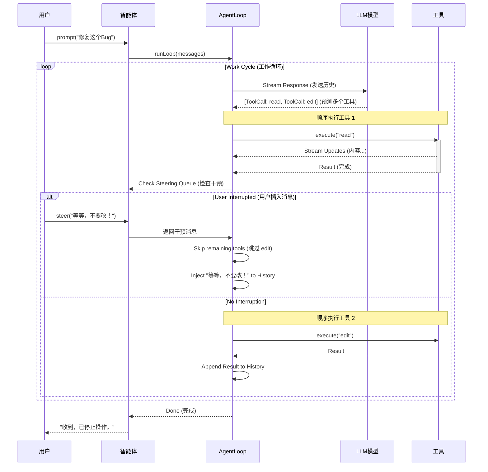
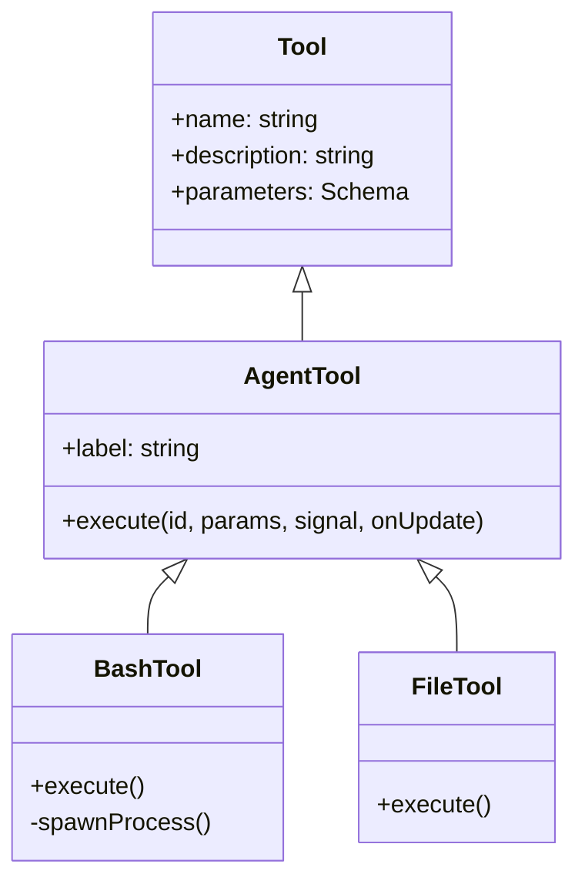

# 核心智能体运行时分析 (`packages/agent`)

## 1. 概述
`packages/agent` 模块实现了 AI 智能体的运行时逻辑。如果说 `packages/ai` 负责与 LLM **对话**，那么 `packages/agent` 则负责 **思考、记忆和行动**。

它实现了一个 "ReAct" (Reasoning + Acting, 推理+行动) 循环，并具备 **Steering (引导/干预)**、**流式工具结果** 和 **状态管理** 等高级特性。

## 2. 核心组件

### 2.1 `Agent` 类 (`agent.ts`)
`Agent` 类是主要入口点。它是一个有状态的对象，维护着：
*   **状态 (State)**: 对话历史 (`messages`)、当前模型、工具和系统提示词。
*   **队列 (Queues)**:
    *   `steeringQueue`: 在当前工具执行完毕后，**立即**中断智能体的消息。
    *   `followUpQueue`: 等待智能体完成当前任务后再处理的消息。
*   **生命周期 (Lifecycle)**: 它发出 UI 订阅的事件（`message_start`, `tool_execution_start`, `turn_end`）。

### 2.2 智能体循环 (`agent-loop.ts`)
这是智能体的“引擎”。它被设计为一个生成器/流，不断产生事件。

**循环逻辑:**
1.  **开始回合 (Start Turn)**: 发送历史记录给 LLM。
2.  **流式响应 (Stream Response)**: 接收来自 LLM 的文本/思考/工具调用。
3.  **检查工具 (Check for Tools)**:
    *   如果没有工具调用：回合结束。
    *   如果有工具调用：
        1.  **执行工具**: 依次调用 `tool.execute()`。注意：当前实现是 **顺序执行** 工具调用（`await tool.execute` 在 `for` 循环中），这意味着智能体不能同时运行两个耗时的 Bash 命令。
        2.  **检查引导 (Check Steering)**: *关键设计点*。每执行完一个工具后，**立即**检查 `steeringQueue`。如果发现用户干预消息，剩余的工具调用将被 **跳过**（Skipped），并将干预消息注入上下文。
        3.  **循环**: 将工具结果追加到历史记录，并回到第 1 步（将结果给 LLM）。

### 2.3 AgentTool 详解 (vs MCP)
该项目未使用官方的 MCP (Model Context Protocol)，而是定义了自己的 `AgentTool` 接口。

#### 接口定义 (`types.ts`)
```typescript
interface AgentTool<TParameters, TDetails> extends Tool<TParameters> {
    label: string; // UI 显示标签
    execute: (
        toolCallId: string,
        params: TParameters,
        signal?: AbortSignal,
        onUpdate?: (partialResult: AgentToolResult<TDetails>) => void
    ) => Promise<AgentToolResult<TDetails>>;
}
```

#### 关键差异分析
1.  **流式反馈 (Streaming Feedback)**:
    *   **AgentTool**: `onUpdate` 回调是核心设计。工具可以像 `stream.push` 一样实时推送数据。例如 `bash` 工具，每当子进程有 stdout 输出时，就会调用 `onUpdate`。UI 层（TUI/Web）订阅这些更新并实时渲染。
    *   **MCP**: 标准 MCP 是基于 JSON-RPC 的。虽然支持 Notifications，但通常工具执行被视为一个 Request-Response 周期。要实现流式传输，需要复杂的带外通道或特定的协议扩展。
2.  **进程内 vs 进程外**:
    *   **AgentTool**: 在 `agent` 进程内直接执行（虽然 `bash` 工具会 spawn 子进程，但控制逻辑在主进程）。这使得状态共享（如 `cwd`）非常容易，但也意味着工具崩溃可能影响 Agent。
    *   **MCP**: 设计为 Client-Server 架构，工具通常运行在独立进程中。
3.  **中断控制**:
    *   **AgentTool**: 传递 `AbortSignal`。当用户在 TUI 按下 `Ctrl+C` 时，Agent 会触发 `abortController.abort()`，所有正在运行的 `tool.execute` 都会收到信号并负责清理资源（例如 `kill` 子进程）。

## 3. 状态管理与并发

### 状态维护
`Agent` 类持有的 `_state` 对象是单一事实来源：
*   **Messages**: `AgentMessage[]` 数组。它不仅包含标准的 `User/Assistant` 消息，还包含 UI 专用的消息（如 `BashExecutionComponent` 的状态）。
*   **转换**: 在发送给 LLM 之前，`convertToLlm` 函数会将这些丰富的内部消息“降级”为 LLM 能理解的纯文本/图片消息。

### 并发模型 (Concurrency)
*   **工具执行**: 目前是 **串行 (Sequential)** 的。LLM 可以一次请求调用多个工具（例如 `ls` 和 `cat`），但 `agent-loop.ts` 会按顺序一个接一个地执行。
    *   *优点*: 避免了文件系统竞态条件（例如一个工具写，一个工具读）。
    *   *缺点*: 速度较慢，无法利用并行 I/O。
*   **用户交互并发**:
    *   **Steering**: 用户输入与 Agent 执行是“并发”的。用户可以在 Agent 思考或执行工具时输入。这些输入被放入 `steeringQueue`，并在下一个“微任务检查点”（工具执行间隙）被处理。

## 4. 图表

### 时序图：智能体循环与干预


### 类图：AgentTool 继承关系


## 5. 总结
`packages/agent` 的设计哲学是 **“人机紧密协作”**。
*   它不追求完全自主的异步并发，而是追求 **可控性**（通过 Steering）。
*   它不追求通用的协议（MCP），而是追求 **体验**（通过流式 Tool Update）。
*   它通过简单的内存状态和明确的生命周期事件，构建了一个易于调试和扩展的运行时。
