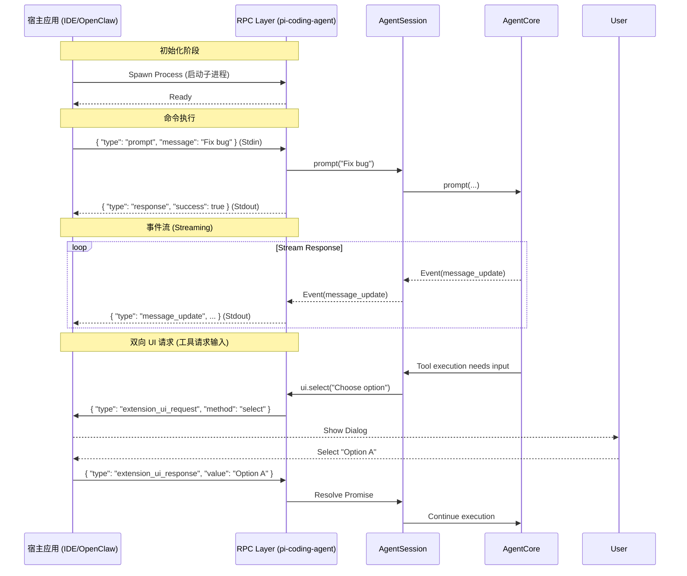

# 编码智能体逻辑与 RPC 架构分析 (`packages/coding-agent`)

## 1. 概述
`packages/coding-agent` 模块是“应用层”，它将通用的智能体运行时转变为专门的软件工程师。它提供了 **大脑** (Prompts)、**双手** (Tools) 和 **面孔** (Interactive Mode & RPC)。

## 2. 提示词工程 (Prompt Engineering)
系统提示词不是一个静态字符串，而是根据上下文动态构建的 (`core/system-prompt.ts`)。

### 关键特性
1.  **动态工具指引**: 提示词根据启用了哪些工具而变化。
2.  **上下文加载**: 自动注入“项目上下文”（用户选择的文件）和“技能”（自定义指令）。
3.  **防御性提示**: 明确指令以防止常见的 LLM 错误。

## 3. RPC 架构详解
`coding-agent` 不仅是一个 CLI 工具，还可以通过 **RPC (远程过程调用)** 模式嵌入到其他应用中（如 IDE 插件、OpenClaw）。

### 3.1 协议设计 (`src/modes/rpc/rpc-types.ts`)
通信基于标准输入/输出 (Stdin/Stdout) 的 JSON 消息流。

*   **Commands (请求)**: 宿主应用 -> Agent
    ```json
    { "id": "1", "type": "prompt", "message": "Analyze this file" }
    ```
*   **Responses (响应)**: Agent -> 宿主应用
    ```json
    { "id": "1", "type": "response", "command": "prompt", "success": true }
    ```
*   **Events (事件流)**: Agent -> 宿主应用 (单向推送)
    ```json
    { "type": "message_update", "message": { ... } }
    ```
*   **Extension UI Requests (扩展 UI 请求)**: Agent -> 宿主应用 -> Agent
    *   Agent 请求 UI（例如 `select` 对话框），宿主渲染并返回结果。

### 3.2 运行流程 (`src/modes/rpc/rpc-mode.ts`)
1.  **初始化**: `runRpcMode` 启动，监听 `readline` (Stdin)。
2.  **事件订阅**: 订阅 `AgentSession` 的所有事件，并通过 `console.log(JSON.stringify(event))` 转发给宿主。
3.  **UI 上下文代理**: 创建一个特殊的 `ExtensionUIContext`。当扩展调用 `ui.select()` 时，不再在本地 TUI 渲染，而是发送 `extension_ui_request` JSON 包给宿主，并挂起 Promise 等待 `extension_ui_response`。

### 3.3 事件驱动架构
整个系统是高度事件驱动的。
*   **输入端**: Stdin 接收 JSON 命令 -> 解析 -> 调用 `session.prompt()` 或 `session.steer()`。
*   **输出端**: `AgentSession` 发出 `message_delta` -> RPC 层捕获 -> 序列化 -> Stdout。

这种设计使得 Agent 可以“无头 (Headless)”运行，完全由外部程序控制其生命周期和 UI 展示。

## 4. 图表

### 时序图：RPC 交互流程


## 5. 工具实现与截断
### Bash 工具 (`core/tools/bash.ts`)
*   **截断策略**: 限制输出（默认 2KB）。
*   **流式传输**: 通过 `onUpdate` 实时回显。
*   **安全性**: 独立进程树。

### 编辑工具 (`core/tools/edit.ts`)
*   **核心逻辑**: 必须 `oldText` 精确匹配，否则拒绝执行。
*   **Diff**: 自动生成 diff 供用户确认。

## 6. 总结
`coding-agent` 的 RPC 模式将其从一个单一的 CLI 工具提升为一个通用的 **Agent 后端服务**。它不仅暴露了 LLM 的能力，还暴露了文件系统操作、工具执行和 UI 交互能力，使得宿主应用无需重新实现这些复杂的底层逻辑。
