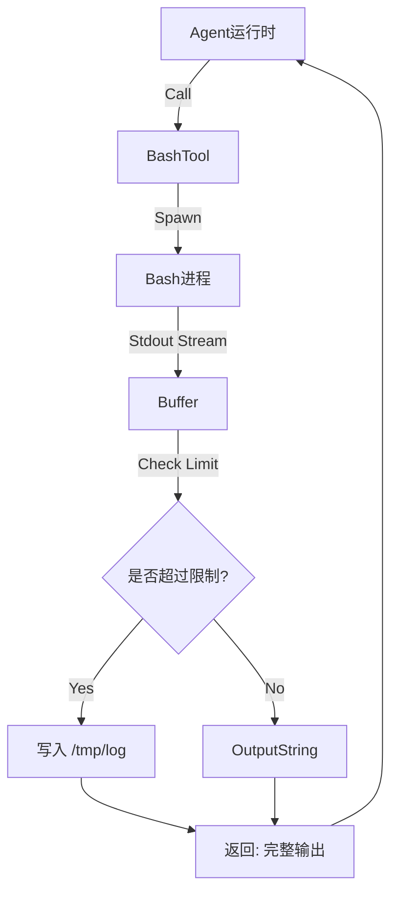
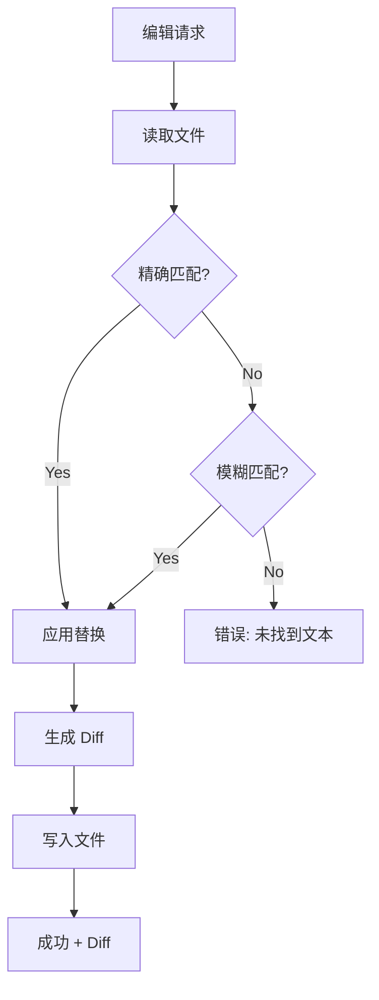

# 编码智能体逻辑分析 (`packages/coding-agent`)

## 1. 概述
`packages/coding-agent` 模块是“应用层”，它将通用的智能体运行时转变为专门的软件工程师。它提供了 **大脑** (Prompts)、**双手** (Tools) 和 **面孔** (Interactive Mode)。

它的独特之处在于它是一个“重”客户端——它不仅仅是向 API 发送文本；它运行完整的 TUI，管理本地进程，并处理大规模的本地文件操作。

## 2. 提示词工程 (Prompt Engineering) (`core/system-prompt.ts`)
系统提示词不是一个静态字符串，而是根据上下文动态构建的。

### 关键特性
1.  **动态工具指引**: 提示词根据启用了哪些工具而变化。
    *   *如果有 `bash`*: "使用 bash 进行文件操作..."
    *   *如果有 `grep`*: "优先使用 grep/find... 而不是 bash 进行探索（更快，且遵循 .gitignore）"
2.  **上下文加载**: 自动注入“项目上下文”（用户选择的文件）和“技能”（自定义指令）。
3.  **防御性提示**: 明确指令以防止常见的 LLM 错误：
    *   "在 `edit` 之前先使用 `read`。"
    *   "使用 `edit` 进行精确更改（旧文本必须完全匹配）。"
    *   "直接输出纯文本... 不要使用 cat 或 bash 来显示你做了什么。"

### 模板系统 (`core/prompt-templates.ts`)
用户可以定义存储为 Markdown 文件的宏（例如 `/fixbug`）。
*   **参数替换**: 支持类似 bash 的语法 (`$1`, `$@`, `${@:2}`)。
*   **源解析**: 从全局配置、项目配置或显式路径加载。

## 3. 工具实现 (`core/tools/`)
这些工具专为本地环境的 **可靠性** 和 **安全性** 而设计。

### 3.1 Bash 工具 (`bash.ts`)
*   **截断策略**: 为了防止淹没上下文窗口，它限制输出（默认 2KB 或 50 行）。如果被截断，它将完整输出保存到临时文件，并告诉 LLM 该路径。
*   **流式传输**: 它通过 `onUpdate` 实时将 stdout/stderr 流式传输到 UI，因此用户可以看到进度（例如 `npm install`）。
*   **安全性**: 在独立的进程树中运行，以确保存 `killProcessTree` 在取消时能可靠工作。

### 3.2 编辑工具 (`edit.ts`)
*   **精确匹配要求**: 要求 `oldText` 必须与文件内容完全匹配。这防止了“幻觉编辑”，即 LLM 试图替换不存在的代码。
*   **模糊回退**: 如果精确匹配失败，它会尝试模糊匹配（忽略空白字符差异），以便对轻微的格式问题更加宽容。
*   **Diff 生成**: 自动生成统一的差异 (unified diff)，这对于用户审查更改至关重要。

### 3.3 读取工具 (`read.ts`)
*   **分页**: 支持 `offset` 和 `limit`。如果文件太大，工具返回部分视图并指示 LLM：“使用 offset=X 继续”。
*   **图像支持**: 自动检测图像，调整大小（最大 2000x2000），并作为多模态内容发送。

## 4. 交互模式 (`modes/interactive/`)
这是一个复杂的 TUI 应用程序，而不仅仅是一个 REPL。

### 架构
*   **事件驱动**: 订阅 `AgentSession` 事件（`message_start`, `tool_execution_update`）。
*   **组件化**: 使用基于组件的 UI 库 (`pi-tui`) 渲染聊天、编辑器、状态栏和工具输出。
*   **斜杠命令**: 在聊天输入中实现类似 CLI 的接口（`/model`, `/compact`, `/fork`）。

### 值得注意的功能
*   **压缩 (Compaction)**: 当上下文变满时，它可以“压缩”历史记录——总结旧的回合，同时保持最新的上下文处于活动状态。
*   **引导 (Steering)**: 允许用户在智能体运行时输入。输入被排队并在工具执行 *之间* 注入。
*   **分叉 (Forking)**: 用户可以从之前的任何消息“分叉”会话，尝试不同的方法。

## 5. 图表

### 流程图：工具执行与截断

### 流程图：编辑工具逻辑

## 6. 评估

### 优点
1.  **健壮的本地工具**: `bash` 和 `read` 工具中的截断和分页逻辑是生产级的。它处理了会破坏简单 Agent 的现实场景（大日志、大文件）。
2.  **安全优先**: `edit` 工具坚持要求匹配 `oldText`，防止了简单的 `sed` 或 `overwrite` 工具常见的“搜索和替换灾难”。
3.  **丰富的用户体验**: TUI 提供了对智能体执行“黑盒”的可视化（流式日志、思考 Token）。

### 缺点
1.  **复杂性**: `InteractiveMode` 类非常庞大（God Class）。它处理渲染、输入、命令和会话管理。将其重构为更小的控制器将提高可维护性。
2.  **Bash 依赖**: 系统严重依赖 `bash`, `fd`, 和 `rg`。Windows 支持可能需要 WSL 或特定的二进制文件，增加了使用门槛。

## 7. 总结
`coding-agent` 包将通用的智能体运行时转变为功能强大的开发者工具。它的优势在于其 **健壮的工具实现**，能够处理文件系统和长运行进程的复杂现实。
