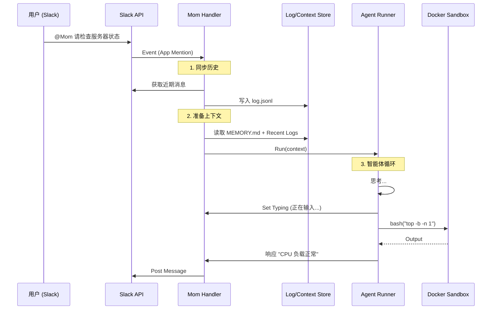

# 外围软件包深度分析 (Mom, TUI, Web-UI, Pods)

## 1. Mom: 自动驾驶的 Slack 机器人 (`packages/mom`)

Mom ("Master Of Mischief") 是一个高度自主的 Slack 机器人。它不仅仅是一个聊天接口，而是一个 **自我管理** 的系统。

### 1.1 核心工作流
Mom 不依赖预装的工具链，而是通过 **Docker 沙箱** 和 **技能脚本** 来构建自己的能力。

*   **隔离执行**: 所有 `bash` 命令都在 Docker 容器中运行，保护宿主机安全。
*   **持久化记忆**:
    *   `log.jsonl`: 频道的完整历史记录（无限追加）。
    *   `context.jsonl`: 发送给 LLM 的上下文窗口（会进行压缩）。
    *   `MEMORY.md`: 长期记忆（项目规范、用户偏好）。

### 1.2 消息处理生命周期
1.  **Slack Event**: 收到 `@Mom` 提及。
2.  **Backfill (回填)**: 读取 Slack 频道的近期历史，同步到 `log.jsonl`，确保 Mom 知道上下文（即使她没有被提及的消息）。
3.  **Context Sync**: 将 `log.jsonl` 的相关部分加载到 `context.jsonl`。
4.  **Agent Run**: 启动 `AgentSession`。
    *   Agent 决定调用工具（如 `bash`）。
    *   工具在 Docker 中执行。
    *   Agent 生成回复。
5.  **Slack Response**: 将回复发回 Slack（支持线程回复）。

### 1.3 时序图：Mom 消息处理


## 2. 终端 UI 框架 (`packages/tui`)

### 2.1 差分渲染引擎
TUI 不会每次都重绘整个屏幕，而是计算 **Diff**。
*   **策略 1**: 首次渲染 -> 输出所有行。
*   **策略 2**: 滚动更新 -> 将光标移动到第一行变化的行，清除之后的内容，重绘变更部分。
*   **策略 3**: 全量重绘 -> 仅在终端尺寸变化时触发。

### 2.2 输入处理
使用 `matchesKey` 函数处理复杂的 ANSI 转义序列。它能区分 `Tab` vs `Shift+Tab`，以及识别 Kitty 键盘协议的高级按键。

## 3. Web UI 与 Artifacts (`packages/web-ui`)

### 3.1 Artifacts (工件) 实现
Web UI 模仿了 Claude Artifacts 的功能。
*   **识别**: 监听 LLM 输出的 Markdown 代码块（如 ` ```html ... ``` `）。
*   **渲染**: 将代码块提取出来，放入一个 **沙盒 Iframe** 中执行。
*   **安全性**: Iframe 使用 `sandbox="allow-scripts"`，但没有 `allow-same-origin`，防止访问主页面的 Cookie 或 LocalStorage。

### 3.2 浏览器端工具
利用浏览器的能力作为工具：
*   **JS REPL**: 在 Worker 线程或沙盒中执行 JavaScript 代码。
*   **文档提取**: 使用浏览器的 DOM Parser 提取网页内容。

## 4. Pods: vLLM 部署 (`packages/pods`)

### 4.1 智能 GPU 调度
*   **自动检测**: 启动时检查 Pod 的 GPU 数量和显存。
*   **模型分配**: 如果请求启动多个模型，`pods` 会自动将它们分配到不同的 GPU 上，或者利用 vLLM 的张量并行 (Tensor Parallelism) 跨 GPU 运行大模型。

### 4.2 存储抽象
通过挂载 NFS（如 DataCrunch 的 SFS），模型权重只需下载一次，即可在多个 Pod 间共享，极大地减少了冷启动时间。

## 5. 总结
这些外围包展示了 `pi-mono` 核心的极强适应性。无论是 Docker 容器中的 Slack 机器人，还是浏览器中的 Web 应用，底层的 `agent` 和 `ai` 逻辑保持一致，而副作用（IO、渲染）被适配层完美隔离。
