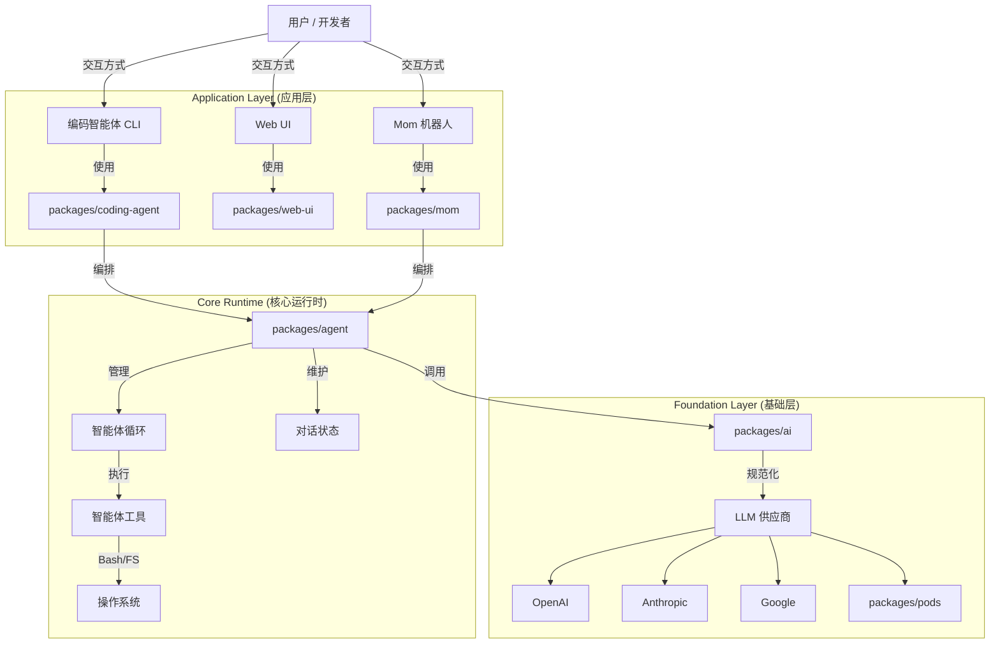

# 综合与竞品分析

## 1. 比较分析

### 1.1 提示词工程 (Prompt Engineering)
**本项目 vs. LangChain/标准模板**

*   **动态上下文构建**: 与简单教程中常见的静态模板不同，`packages/coding-agent/src/core/system-prompt.ts` 在运行时 *以编程方式* 构建提示词。它检查哪些工具可用（例如 `bash`, `grep`），并仅在相关时注入特定指南。
*   **技能注入**: 它有一个专门的“技能”系统（用户定义的提示模块），有效地允许用户动态“修补”系统提示词。
*   **防御性提示**: 它明确防范常见的模型故障（例如，“在编辑前先读取”，“不要输出 bash stdout”）。这种“经验内化”的方法优于通用的“你是一个有用的助手”提示。

### 1.2 智能体编排 (Agent Orchestration)
**本项目 vs. LangGraph / AutoGPT**

*   **循环架构**: `packages/agent` 中的 `agentLoop` 是一个经典的 ReAct 循环，但通过 **Steering (引导)** 进行了增强。
*   **引导 (独特功能)**: 大多数框架（如 LangChain 的基本 agent executor）会阻塞直到智能体完成。本项目的“引导队列” (`steeringQueue`) 允许用户在 *工具调用之间* 注入消息。这对于编码智能体来说是一个巨大的可用性优势——用户看到错误的命令时可以立即大喊“停止！”。
*   **状态管理**: 它使用一个简单的内存状态对象。与 LangGraph 复杂的图状态持久化相比，这更简单，但如果状态变得复杂则较难调试。然而，`mom` 中的 `log.jsonl`（事实来源）方法是处理长期持久化的一种健壮方式。

### 1.3 工具与 MCP (模型上下文协议)
**它使用 MCP 吗？**
不，本项目 **不使用官方的模型上下文协议 (MCP)** SDK。相反，它使用自定义的 `AgentTool` 接口。

**比较:**
| 特性 | 本项目 (`AgentTool`) | 官方 MCP |
| :--- | :--- | :--- |
| **协议** | 进程内 TypeScript 接口 | 基于 Stdout/HTTP 的 JSON-RPC |
| **流式传输** | 一等公民 `onUpdate` 回调 | 支持但复杂 (Notifications) |
| **发现** | 静态注册 | 动态能力协商 |
| **互操作性** | 仅限内部 | 通用 (Claude Desktop, IDEs) |

**为何有差异？**
本项目可能需要 **紧密集成** 来实现以下功能：
1.  **流式工具输出**: `bash` 工具逐行将 stdout 流式传输到 TUI。这对用户体验至关重要（可以看到 `npm install` 的进度）。标准 MCP 通常是请求/响应模式，虽然支持通知，但不如回调直接。
2.  **控制流**: `Steering`（引导）机制依赖于运行时对工具执行循环的紧密控制。

## 2. 最终系统架构



## 3. 带注释的文件树

```text
.
├── packages/
│   ├── ai/                     # [基础层] 统一 LLM 接口
│   │   ├── src/types.ts        #   - 核心类型 (Model, Message, Stream)
│   │   └── src/providers/      #   - OpenAI, Anthropic 等适配器
│   │
│   ├── agent/                  # [运行时] 核心智能体逻辑
│   │   ├── src/agent.ts        #   - Agent 类 (状态容器)
│   │   └── src/agent-loop.ts   #   - ReAct 循环 (思考 -> 行动 -> 重复)
│   │
│   ├── coding-agent/           # [产品] CLI 编码助手
│   │   ├── src/core/system-prompt.ts # - 动态提示词工程
│   │   ├── src/core/tools/     #   - 健壮的工具 (Bash, Read, Edit)
│   │   └── src/modes/          #   - TUI / 交互模式逻辑
│   │
│   ├── tui/                    # [UI] 终端用户界面库
│   │   └── src/                #   - 组件 (Editor, Markdown, Spinner)
│   │
│   ├── mom/                    # [产品] 自我管理 Slack 机器人
│   │   └── src/                #   - Slack 适配器 & Docker 沙箱管理
│   │
│   ├── web-ui/                 # [UI] Web 组件
│   │   └── src/                #   - 工件渲染, JS REPL
│   │
│   └── pods/                   # [运维] vLLM 部署工具
│       └── src/                #   - 云提供商 API (RunPod, DataCrunch)
│
├── analysis/                   # 生成的分析报告
│   ├── 01_global_architecture.md
│   ├── 02_core_agent_runtime.md
│   ├── 03_coding_agent_deep_dive.md
│   ├── 04_peripheral_packages.md
│   └── 05_synthesis_and_comparison.md
└── AGENTS.md                   # 给 AI 智能体的指令 (元指令!)
```

## 4. 优缺点总结

### 优点
*   **流式优先 (Streaming First)**: 整个架构（从 `ai` 到 `tui`）都是围绕流式传输构建的。这带来了响应极快的 UI，用户可以立即看到思考过程和工具输出。
*   **健壮的工具 (Robust Tooling)**: 工具不是玩具实现。它们处理了边缘情况，如大文件（截断/分页）和无限循环（超时）。
*   **抽象 (Abstraction)**: `ai` 包是一个隐藏的宝石。比起许多商业 SDK，它更好地抽象了“思考”模型和不同供应商的怪癖。

### 缺点
*   **复杂性**: 分离成 7 个以上的包增加了开销。在调用栈中从 `coding-agent` -> `agent` -> `ai` -> `provider` 导航可能会让人心智负担过重。
*   **非标准工具**: 由于没有采用 MCP，它错过了社区构建的 MCP 服务器生态系统（例如 Google Drive, Slack, Linear 集成）。它必须自己构建所有东西。

## 5. 结论
该项目是一个 **高度成熟、生产级的智能体系统**。在 **开发者助手** 这一特定用例上，它不仅可以媲美（并且在某些 UX 方面优于）LangChain/LangGraph 等框架。其自定义运行时允许实现“引导 (Steering)”和“流式工具输出”等功能，而这些功能在通用框架中通常难以顺畅支持。
