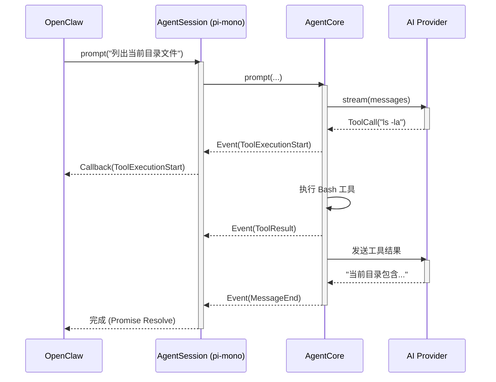

# OpenClaw 与 pi-mono 的集成关系分析

## 1. 关系概述

**OpenClaw** 与 **pi-mono** 的关系是 **消费者 (Consumer)** 与 **库/框架 (Library/Framework)** 的关系。

*   **pi-mono** (特别是 `packages/coding-agent` 和 `packages/agent`) 提供了核心的 AI 智能体运行时、工具执行环境和 LLM 抽象层。
*   **OpenClaw** 是一个构建在 `pi-mono` 之上的实际应用案例（Real-world Application）。它利用 `pi-mono` 提供的 SDK 接口，将编码智能体的能力集成到其自己的业务逻辑或用户界面中。

简单来说，`pi-mono` 造了“引擎”，而 `OpenClaw` 是使用这个“引擎”制造的“汽车”。

## 2. 集成方式

根据 `packages/coding-agent` 的设计，外部应用（如 OpenClaw）主要通过以下两种方式集成：

### 2.1 SDK 集成 (直接调用)
这是最紧密的集成方式。OpenClaw 直接引入 `@mariozechner/pi-agent-core` 或 `@mariozechner/pi-coding-agent` 的 npm 包。

**核心类:**
*   **`AgentSession`**: 这是 `coding-agent` 包暴露的主要门面（Facade）。它封装了会话状态、文件系统上下文、工具注册和 LLM 交互。
*   **`Agent`**: `agent` 包的核心运行时。

**集成代码示例 (概念性):**
```typescript
import { AgentSession } from "@mariozechner/pi-coding-agent";

// 1. 初始化会话
const session = new AgentSession({
    cwd: "/path/to/project",
    // 注入 OpenClaw 特定的设置
});

// 2. 启动/加载
await session.start();

// 3. 发送指令
session.prompt("帮我重构这个函数", {
    // 注册回调以接收实时流式输出
    onProgress: (event) => {
        OpenClawUI.render(event);
    }
});
```

### 2.2 RPC 集成 (进程间通信)
如果 OpenClaw 是用非 Node.js 语言编写（如 Python 或 Go），或者希望运行在独立进程中，它会使用 RPC 模式。`pi-mono` 提供了 `rpc` 模式 (`packages/coding-agent/src/modes/rpc/`)。

*   **通信协议**: JSON-RPC (通常通过 Stdio 或 WebSocket)。
*   **流程**: OpenClaw 启动 `pi-coding-agent` 作为子进程，通过标准输入输出发送指令。

## 3. 调用关系图解

### 架构图
```mermaid
graph TD
    subgraph "OpenClaw (宿主应用)"
        UI[用户界面]
        Logic[业务逻辑]
        Adapter[适配层]
    end

    subgraph "pi-mono (核心库)"
        SDK[Agent SDK]
        Runtime[Agent Runtime]
        Tools[工具集 (Bash/FS)]
    end

    UI --> Logic
    Logic --> Adapter
    Adapter -->|调用| SDK
    SDK -->|管理| Runtime
    Runtime -->|执行| Tools
```

### 时序图：指令执行流程
展示 OpenClaw 如何通过 SDK 调用 pi-mono 并获取结果。



## 4. 总结
OpenClaw 是 `pi-mono` 生态系统中的一个 **下游实现**。它证明了 `pi-mono` 不仅仅是一个独立的 CLI 工具，而是一个可复用的 **Agent 操作系统**。通过封装复杂的 Prompt 工程、工具安全沙箱和 LLM 规范化，`pi-mono` 让 OpenClaw 能够专注于上层应用场景，而无需重复造轮子。
